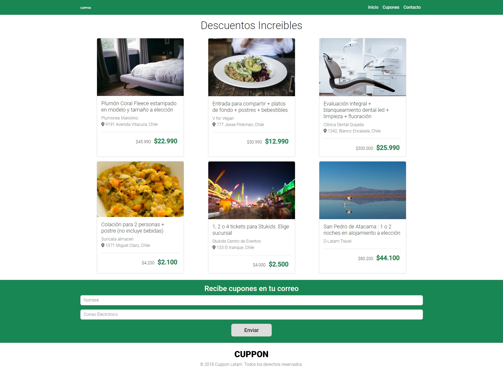

# Desafio Evaluado - Cuppon

Este proyecto web está diseñado para presentar cupones con descuentos y ofertas especiales. Los usuarios pueden explorar diferentes cupones, sus detalles y recibir nuevos cupones en su correo electrónico.

## Descripción

Cuppon es un sitio web que ofrece una variedad de cupones y descuentos para productos y servicios locales. La página principal muestra una serie de cupones destacados, y los usuarios pueden suscribirse para recibir ofertas directamente en su correo electrónico.

## Vista Codificada

A continuación, se muestra la imagen del resultado codificado:

## Estructura del Proyecto

El proyecto se compone de las siguientes secciones:

- **Menú de Navegación (`<nav>`)**: Incluye enlaces a las secciones Inicio, Cupones y Contacto.
- **Encabezado (`<header>`)**: Muestra una serie de cupones destacados con sus detalles y precios.
- **Sección de Suscripción (`<section class="bg-success">`)**: Permite a los usuarios suscribirse para recibir cupones por correo electrónico.
- **Pie de Página (`<footer>`)**: Contiene el logotipo de la empresa y un mensaje de derechos reservados.

## Tecnologías Utilizadas

- HTML5
- CSS3
- Bootstrap 5.3.2
- JavaScript (jQuery)
- Font Awesome
- Google Fonts (Roboto)

## Autor

Este proyecto fue desarrollado por **Valeria Torrealba**.